# Homework 1: Route Finding Report

* Name:  
* Student ID:

Notice: 

- Save this file as `REPORT.md`. Put all screenshots in a folder named `result/`.  
- When you submit, include `REPORT.md` and `result/` in your submission zip together with your algorithm files.  
- To insert an image in Markdown, use: ``  
- Example: if your code screenshot is `result/bfs_code.png`, write ``  
- Example: if your map result is `result/bfs_map.png`, write ``  
- Please use a relative path like `result/bfs_code.png` or `result/bfs_map.png`. Do not use your own computer path such as `/Users/yourname/...`  
- In `REPORT.md`, the screenshot paths should be written like this:
  `result/bfs_code.png`, `result/dfs_code.png`, `result/ucs_code.png`, `result/astar_code.png`, `result/astar_time_code.png`
  `result/bfs_map.png`, `result/dfs_map.png`, `result/ucs_map.png`, `result/astar_map.png`, `result/astar_time_map.png`
- Part I asks for **code screenshots**.
- Part II Question 1 asks for **map result images**.
- Part II Question 2 asks for the **comparison table and analysis**.
- Part II Question 3 asks for a **text comparison only** between A\* and A\* Time.
- In Part II, clearly label which public case your map result comes from.

## Part I. Implementation (5%)

1. Insert your screenshot of each algorithm here: (Your algorithm screenshot need to include explanation comment)  
### BFS
BFS expands nodes level by level using a queue which is FIFO.
It guarantees the shortest path (least number of edges) when all edges are same (unweighted).

The Logic of BFS:
- Use a queue to store fringes
- Mark nodes as visited when enqueued
- Track parent to reconstruct path

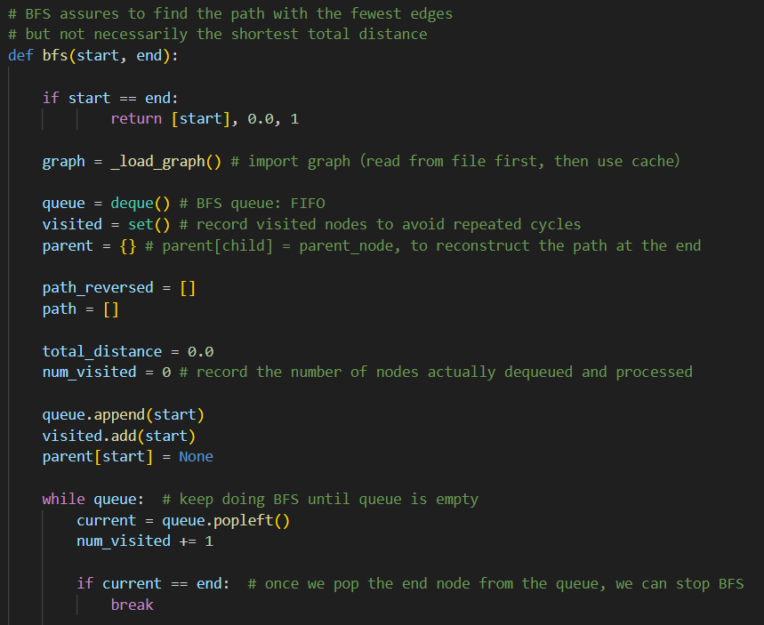
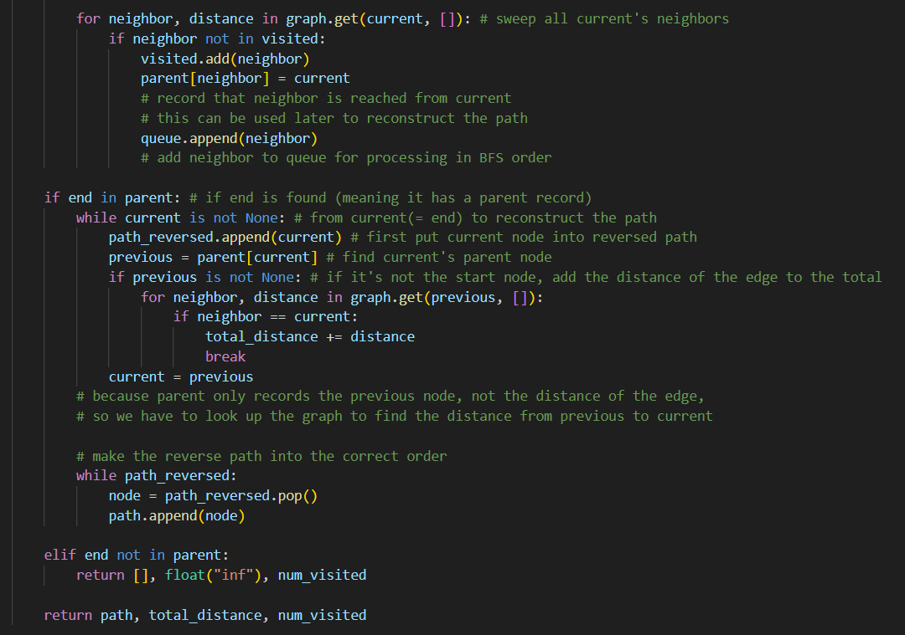

### DFS
DFS expands nodes by going as deep as possible along a branch before backtracking, using a stack which is LIFO.
It does not guarantee the shortest path.

The Logic of DFS:
- Use a stack to store fringes
- Mark nodes as visited when pushed
- Track parent to reconstruct path

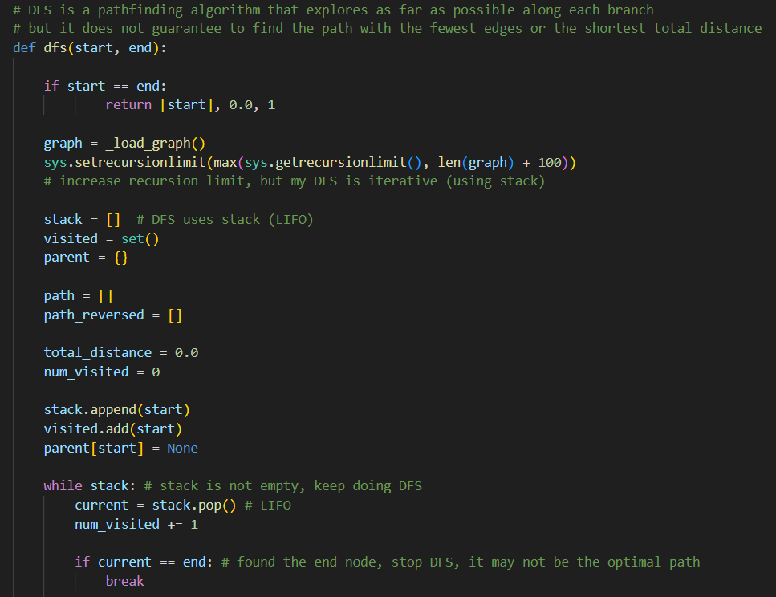
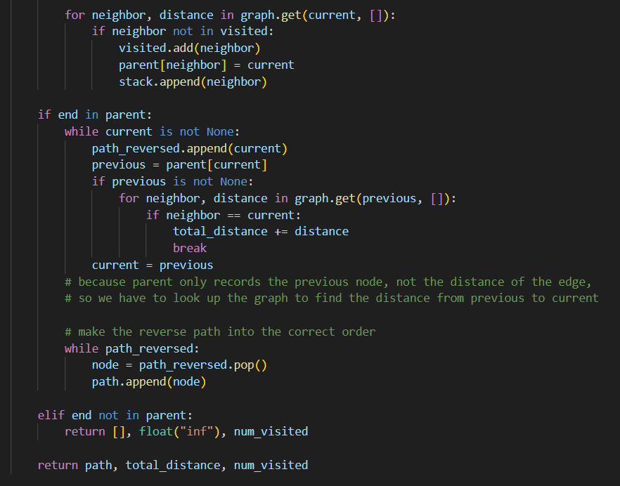

### UCS
UCS expands the node with the lowest cumulative path cost first using a priority queue which is minheap.
It guarantees the optimal shortest path when all edge costs are positive (non-negative).

The Logic of UCS:
- Use a priority queue to store fringes
- Prioritize nodes with the lowest cumulative cost
- Mark nodes as visited when expanded
- Track parent to reconstruct path

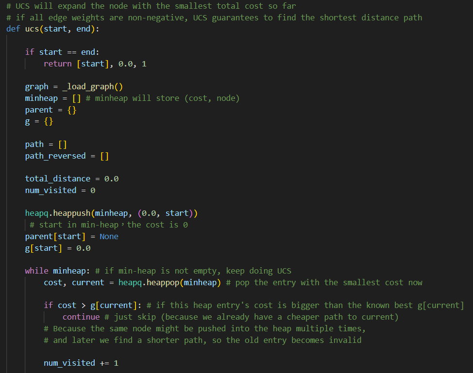
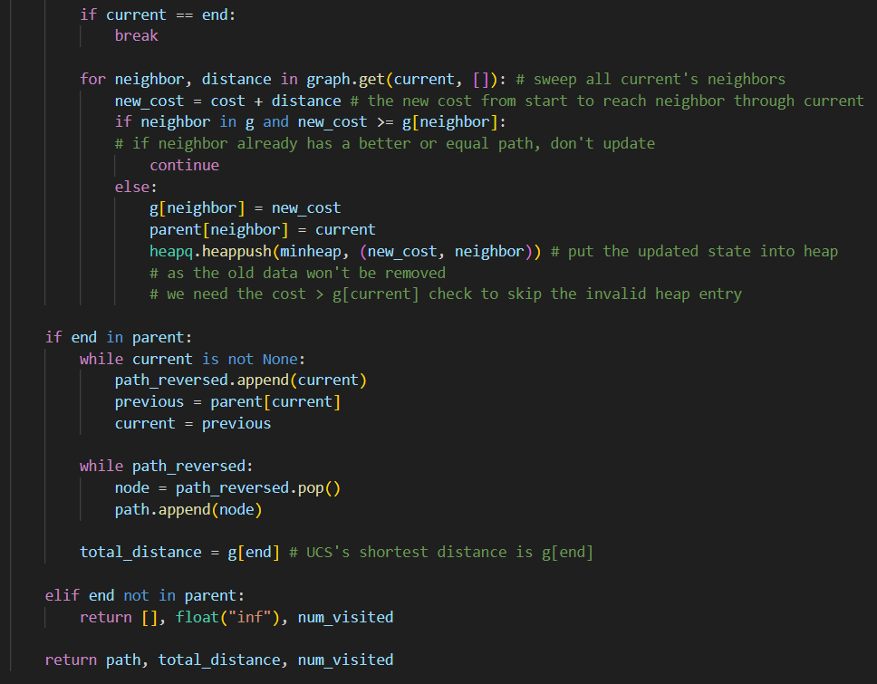

### A\* Search
A* Search expands nodes based on the lowest f(n) = g(n) + h(n) using a priority queue which is minheap.
g(n) = real cost from start to n, and h(n) = estimated cost from n to end.
It guarantees the optimal shortest path if h(n) is admissible (does not overestimate).

The Logic of A* Search:
- Use a priority queue to store fringes
- Prioritize nodes with the lowest f(n) = g(n) + h(n)
- Mark nodes as visited when expanded
- Track parent to reconstruct path

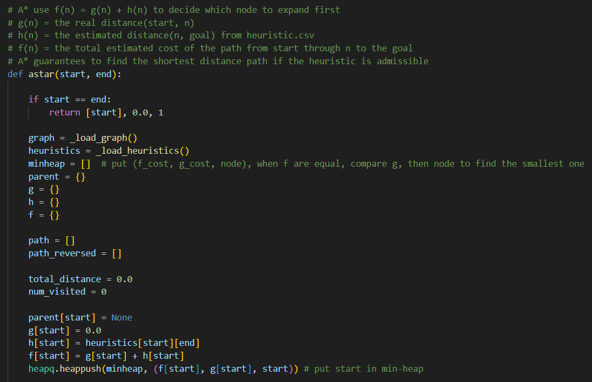  
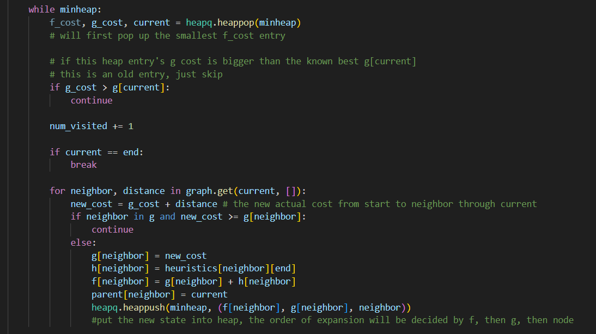
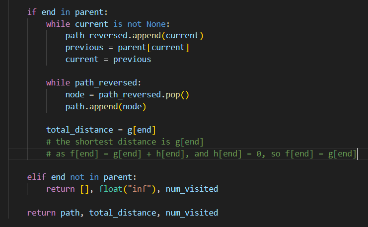

### A\* Time Search
A* Time Search expands nodes based on the lowest f(n) = g(n) + h(n) using a priority queue which is minheap.
g(n) = real travel time from start to n, and h(n) = estimated travel time from n to end.
It guarantees the optimal shortest time path if h(n) is admissible (does not overestimate).

The Logic of A* Time Search:
- Use a priority queue to store fringes
- Prioritize nodes with the lowest f(n) = g(n) + h(n)
- Mark nodes as visited when expanded
- Track parent to reconstruct path

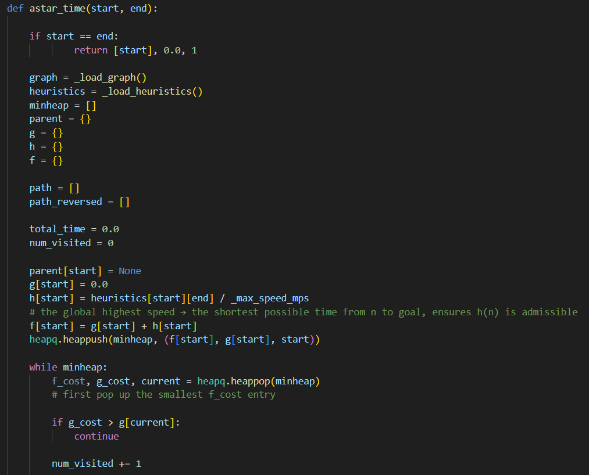 
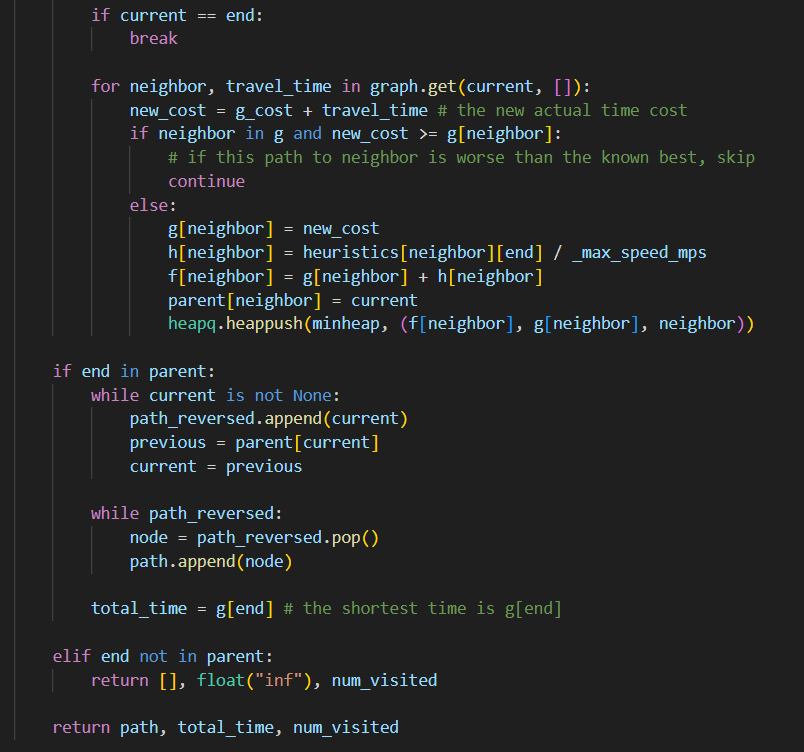

## Part II. Results & Analysis (10%)

1. Insert results of the map:  
    ### BFS
    - Public case 1 in current dataset.
    - path, dist, num_visited = bfs(2773409914, 1079387396)
    
      
    
    ### DFS
    - Public case 1 in current dataset.
    - path, dist, num_visited = bfs(2773409914, 1079387396)
    
      
    
    ### UCS
    - Public case 1 in current dataset.
    - path, dist, num_visited = bfs(2773409914, 1079387396)
    
     
    
    ### A\* Search
    - Public case 1 in current dataset.
    - path, dist, num_visited = bfs(2773409914, 1079387396)
    
      
    
    ### A\* Time Search
    - Public case 1 in current dataset.
    - path, time, num_visited = bfs(2773409914, 1079387396)
    
      

2. Fill in the following table for the same test case. Then analyze the differences between the four algorithms. Your discussion should focus on:  
- path quality,  
- number of expanded nodes,  
- execution-time difference.

| Algorithm | Path length | Nodes expanded | Execution time (s) | Observation |
| :---- | :---: | :---: | :---: | :---- |
| BFS | 5500.1150 | 20715 | 0.01745 | We can see that BFS finds a path that has the least nodes (however not shortest) among the five algorithms; however, the number of nodes expanded is the highest. This shows that BFS might find a relatively short path (when all edges have equal weight) but might need to expand many nodes as it goes level by level. As a result, it spends relatively more execution time as it expands the most nodes in this case. | 
| DFS | 118398.5350 | 7669 | 0.00733 | We can find that DFS finds a path that has the most nodes (and longest) among the five algorithms; however, the number of nodes expanded is less than BFS and UCS. This shows that DFS might find a path that is not optimal (too long in this case); nevertheless, as it expands nodes by going as deep as possible along a branch, it finds the path earlier than BFS and UCS, and in turn executes more quickly in this case. |
| UCS | 4894.6770 | 17051 | 0.01987 | We can see that UCS finds a path that has the second least nodes (but shortest) among the five algorithms (same as A* and A* Time); however, the number of nodes expanded is also the second highest. As all the distances between nodes are positive, UCS should find the optimal shortest path (not BFS, as all edges have different weights) but might need to expand many nodes. As a result, it spends relatively the most execution time as it expands the second most nodes in this case. |
| A\* Search | 4894.6770 | 1486 | 0.00207 | We can see that A* finds a path that has the second least nodes (but shortest) among the five algorithms (same as UCS and A* Time); in addition, the number of nodes expanded is also the lowest. As all the distances between nodes are positive and the heuristic is admissible, A* should find the optimal shortest path without needing to expand many nodes like UCS, because it considers both g(n) and h(n) at the same time. As a result, it spends relatively the least execution time as it expands the least nodes in this case. |
| A\* Time Search | 4894.6770 (Total second: 388.3736) | 7709 | 0.01540 | We can see that A* Time finds a path that has the second least nodes (but shortest) among the five algorithms (same as UCS and A*); however, the number of nodes expanded is much higher than A*. This might be because the heuristic is less informative (too optimistic) than A*, so h(n) is weaker and g(n) is more dominant, and the overall performance becomes closer to UCS. As all the distances between nodes are positive and the heuristic is admissible, A* Time should find the optimal shortest path without needing to expand many nodes like UCS, because it considers both g(n) and h(n) at the same time. Nevertheless, its execution time is longer than A* not only because the number of nodes expanded is much higher than A* but also due to the additional computation of floating-point operations and division when calculating the heuristic. |

3. Analyze the differences between A\* (Part 4\) and A\*Time (Part 5).

    The difference between A* and A* Time is that A* uses distances as the unit, where f(n) = g(n) (aggregate distances) + h(n) (estimated distances); however, A* Time uses time as the unit, where f(n) = g(n) (aggregate time) + h(n) (estimated time), and h(n) is calculated as distance / max_speed.

    In addition, the heuristic of A* Time is more optimistic than that of A* (both admissible), as it divides by the global maximum speed in the heuristic, and this results in the heuristic of A* Time being less informative than that of A*, in turn acting more like UCS.

    Last but not least, due to the weaker heuristic, A* Time has to expand more nodes than A* to find the optimal path (more like UCS). Besides, A* Time’s computational work is also much larger than that of A*. These factors all result in the longer execution time for A* Time compared to A*.

## Part III. Question Answering (15%)

1. Please describe a problem you encountered and how you solved it. 

    我遇到的最大問題是我之前寫演算法時主要都是以 C++ 語言撰寫，對於 Python 的語法更多地停在基礎階段，較少接觸 heapq 或 dictionary 等語法使用，因此在一開始撰寫時遇到了腦中有演算法的想法與構思，但卻不知道如何以 Python 語言表示的問題。後來我經過上網查詢較為細節的 Python 語法，比較與 C++ 語法的差異，最終順利解決了語法不熟悉的問題，撰寫出了可執行的演算法。

2. Real-world maps typically contain many **cycles**. How does your algorithm handle **visited nodes**? If you were to remove the check for visited nodes, what would be the specific impact on the execution processes of **BFS** (Breadth-First Search) and **DFS** (Depth-First Search) respectively?

    對於 BFS 和 DFS 演算法，因為這兩個演算法不考慮每段路徑 cost 或 weight 的問題，我採用了 visited = set() 的方式去紀錄已經訪問的節點，以避免在圖中存在 cycles 時，重複訪問相同節點，甚至造成無限迴圈的情況。
    
    而對於 UCS、A* 與 A* Time 這三個演算法，雖然沒有使用相同的 visited = set()，但仍透過記錄每個節點的最佳總累積成本 g(n) 來避免重複且無效的擴展。假設某一個節點被再次發現時，只有在新的總累積成本較小的情況下才會被更新並重新加入 priority queue，否則會被忽略。這種機制不僅可以避免無限循環，也能確保演算法找到 optimal path。
    
    對於 BFS 而言，若不使用 visited = set() 的機制，當 BFS 在一層一層展開節點時，可能會不斷將已訪問過的節點重新加入 queue，導致這些節點被重複擴展，使時間複雜度大幅增加，如果圖中存在cycle，甚至可能無法終止。
    
    對於 DFS 而言，若不使用 visited = set() 的機制，演算法在沿著某條路徑深入時，可能會因為 cycle 反覆進入同一組節點，導致無限迴圈(或遞迴)，使演算法無法結束。

     
3. Under what specific circumstances (e.g., the **weight distribution** of the map) would the path found by **Uniform Cost Search (UCS)** be identical to the path found by **Breadth-First Search (BFS)**? What is your reasoning for this? 

    當所有節點之間的路徑權重皆一致時，UCS 和 BFS 找到的路徑將會基本一樣，且皆是 optimal。原因是 BFS 和 UCS 皆是逐層擴展搜尋，但BFS會找的路徑是所經節點數最少的路徑，而 UCS 會找的路徑是總累積權重成本最低的路徑。當每條路徑的權重皆相同時，其實跟每條路徑皆沒有權重的情況基本一樣，此時 BFS 和 UCS 所找到的路徑皆會是所經節點數最少的路徑。

     
4. The efficiency of the A\* algorithm depends heavily on the heuristic function h(n).  
   - Explain the concept of "Admissibility." What happens if h(n) overestimates the actual distance?

      h(n) 的 Admissibility 表示為 0 ≤ h(n) ≤ h*(n)，其中 h(n) 為從 n 到目標的估計距離，h*(n) 為從 n 到目標的真實距離。當 h(n) 大於 h*(n) 時，表示高估了從 n 到目標的真實距離，此時 A* 演算法 (f(n) = g(n) + h(n)) 將可能因 h(n) 的高估而判斷失誤，無法找到最佳路徑或最優解。  
   
   - In a real-world road network, compare the advantages and disadvantages of using "Euclidean Distance" versus "Manhattan Distance" as the heuristic h(n).

      Euclidean Distance 為兩點之間的直線距離。優點是在一般道路中，Euclidean 的 heuristic 會較接近真實距離，估計較為精準。此外，Euclidean 的 heuristic 相對較 informative，A* 搜尋方向可以更加明確，且擴展節點數相對較少。缺點是直線距離的計算成本較高，需要平方與開根號運算，在大量節點時可能會影響效能。此外，若是在棋盤式城市，多格狀道路只能水平或垂直行走，此時直線距離可能會低估過多，導致 heuristic 不夠準確。

      Manhattan Distance 為兩點之間水平 + 垂直的距離。優點是計算相對簡單（不需要開根號）且計算速度快，適合大量節點數的資料。此外，Manhattan 的 heuristic 更適合棋盤式街道或格狀道路，因為通常只能水平或垂直移動，此時 Manhattan 會相較於 Euclidean 的 heuristic 更貼近真實路徑。缺點是 Manhattan 的 heuristic 在一般道路中可能較不準確，因為真實的道路通常不是完全水平或垂直的，因此 heuristic 可能會高估或偏離實際情況。此外，Manhattan 的 heuristic 通常較不 informative，導致 A* 搜尋較發散，且需要擴展更多節點。

      最後，特別是在 Greedy Search 中（因為僅考慮 h(n)），在存在障礙物的情況下，若使用 Euclidean Distance 作為 heuristic，演算法可能會過度偏向選擇在直線距離上最接近目標的節點。然而，實際路徑可能被障礙物阻擋，導致演算法在該直線方向上進行過多無效的探索，直到碰到障礙物後被迫繞路。這種情況下，heuristic 會產生誤導，使得搜尋效率下降並增加節點擴展數量。

5. Standard A\* search typically employs **Euclidean Distance** as the heuristic function h(n) to minimize physical travel distance. However, in a modern **Smart City** context, the "shortest path" is rarely synonymous with the "best path". Design a **novel heuristic function** based on what you have learned.

    我想到的heuristic是可以把三種資訊做線性組合： 
    $h(n) = \alpha \cdot E(n) + \beta \cdot M(n) + \gamma \cdot T(n)$
    
    其中 E(n) 是 Euclidean distance，也就是直線距離，M(n) 是 Manhattan distance，也就是格狀距離，而 T(n) 是根據 Google 即時交通路況所估算的延遲成本，這樣的話就可以同時考慮到幾何距離、道路結構以及道路壅塞狀況，整體更接近綜合考量下的最佳路徑(best path)，而非只是單純的最短路徑(shortest path)。
    
    但這種方式也有一些可能的缺點，譬如 heuristic 有機會在某些情況下失去 admissibility，因為可能因加入 Manhattan 距離或交通延遲而高估勝於成本，導致 A* 不一定保證 optimality，此時在實務上雖然仍可能更符合導航需求，但將無法保證找到理論上的 optimal path（最短路徑），因此此線性組合各項的權重需要進行審慎的評估與優化。

    
